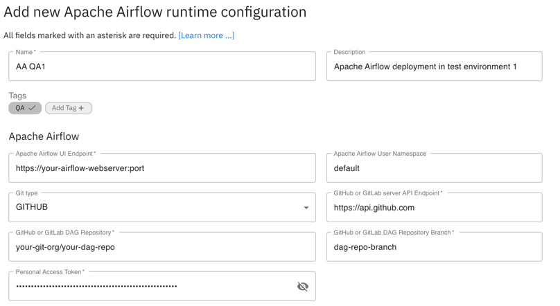

<!--

Copyright 2018-2022 Elyra Authors

Licensed under the Apache License, Version 2.0 (the "License");
you may not use this file except in compliance with the License.
You may obtain a copy of the License at

http://www.apache.org/licenses/LICENSE-2.0

Unless required by applicable law or agreed to in writing, software
distributed under the License is distributed on an "AS IS" BASIS,
WITHOUT WARRANTIES OR CONDITIONS OF ANY KIND, either express or implied.
See the License for the specific language governing permissions and
limitations under the License.

-->


# Configuring Apache Airflow on Kubernetes for use with Elyra 

Pipelines in Elyra can be run locally in JupyterLab, or remotely on Kubeflow Pipelines or Apache Airflow to take advantage of shared resources that speed up processing of compute intensive tasks.

**Note: Support for Apache Airflow is experimental.**

This document outlines how to set up a new Elyra-enabled Apache Airflow environment or add Elyra support to an existing deployment.
  
This guide assumes a general working knowledge of and administration of a Kubernetes cluster.

## Prerequisites
  
- A private git repository on github.com, GitHub Enterprise, gitlab.com, or GitLab Enterprise that is used to store DAGs.
- S3-based cloud object storage e.g. IBM Cloud Object Storage, Amazon S3, MinIO

AND  
  
- A Kubernetes Cluster without Apache Airflow installed
    - Ensure Kubernetes is at least v1.18. Earlier versions might work  but have not been tested.
    - Helm v3.0 or later
    - Use the [Helm chart](https://github.com/airflow-helm/charts/tree/v3.12.0rc1/charts/airflow) available in the Airflow source distribution with the [Elyra sample configuration](https://raw.githubusercontent.com/elyra-ai/elyra/v3.12.0rc1/etc/kubernetes/airflow/helm/values.yaml).
    
OR  
  
- An existing Apache Airflow cluster 
    - Ensure Apache Airflow is at least v1.10.8 and below v2.0.0. Other versions might work but have not been tested.
    - Apache Airflow is configured to use the Kubernetes Executor.
    - Ensure the KubernetesPodOperator is installed and available in the Apache Airflow deployment
    
## Setting up a DAG repository on Git

In order to use Apache Airflow with Elyra, it must be configured to use a Git repository to store DAGs.

- Create a private repository on github.com, GitHub Enterprise, gitlab.com, or GitLab Enterprise. (Elyra produces DAGs that contain credentials, which are not encrypted. Therefore you should not use a public repository.) Next, create a branch (e.g `v3.12.0rc1`) in your repository. This will be referenced later for storing the DAGs. 
- Generate a personal access token with push access to the repository. This token is used by Elyra to upload DAGs.
   - [Instructions for GitHub](https://docs.github.com/en/github/authenticating-to-github/creating-a-personal-access-token)
   - [Instructions for GitLab](https://docs.gitlab.com/ee/user/profile/personal_access_tokens.html)
- Generate an SSH key with read access for the repository. Apache Airflow uses a git-sync container to keep its collection of DAGs in synch with the content of the Git Repository and the SSH key is used to authenticate. **Note: Make sure to generate the SSH key using RSA algorithm.**  
   - [Instructions for GitHub](https://docs.github.com/en/github/authenticating-to-github/adding-a-new-ssh-key-to-your-github-account)
   - [Instructions for GitLab](https://docs.gitlab.com/ee/ssh/)

Take note of the following information:
 - Git API endpoint (e.g. `https://api.github.com` for github.com or `https://gitlab.com` for gitlab.com)
 - Repository name (e.g. `your-git-org/your-dag-repo`)
 - Repository branch name (e.g. `v3.12.0rc1`)
 - Personal access token (e.g. `4d79206e616d6520697320426f6e642e204a616d657320426f6e64`)

You need to provide this information in addition to your cloud object storage credentials when you [create a runtime configuration](../user_guide/runtime-conf) in Elyra for the Apache Airflow deployment.



## Deploying Airflow on a new Kubernetes cluster
  
To deploy Apache Airflow on a new Kubernetes cluster:

1. Create a Kubernetes secret containing the SSH key that you [created earlier](#setting-up-a-dag-repository-on-github).
 The example below creates a secret named `airflow-secret` from three files. Replace the secret name, file names and locations as appropriate for your environment. 
     
   ```bash
   kubectl create secret generic airflow-secret --from-file=id_rsa=.ssh/id_rsa --from-file=known_hosts=.ssh/known_hosts --from-file=id_rsa.pub=.ssh/id_rsa.pub -n airflow
   ```
  
2. Download, review, and customize the [sample `helm` configuration](https://raw.githubusercontent.com/elyra-ai/elyra/v3.12.0rc1/etc/kubernetes/airflow/helm/values.yaml) (or customize an existing configuration). This sample configuration will use the `KubernetesExecutor` by default.
   - Set `git.url` to the URL of the private repository you created earlier, e.g. `ssh://git@github.com/your-git-org/your-dag-repo`. **Note: Make sure your ssh URL contains only forward slashes.**   
   - Set `git.ref` to the DAG branch, e.g. `v3.12.0rc1` you created earlier.
   - Set `git.secret` to the name of the secret you created, e.g. `airflow-secret`.
   - Adjust the `git.gitSync.refreshTime` as desired.

   Example excerpt from a customized configuration:

   ```bash
   ## configs for the DAG git repository & sync container
   ##
   git:
     ## url of the git repository
     ##
     ## EXAMPLE: (HTTP)
     ##   url: "https://github.com/torvalds/linux.git"
     ##
     ## EXAMPLE: (SSH)
     ##   url: "ssh://git@github.com:torvalds/linux.git"
     ##
     url: "ssh://git@github.com/your-git-org/your-dag-repo"

     ## the branch/tag/sha1 which we clone
     ##
     ref: "v3.12.0rc1"

     ## the name of a pre-created secret containing files for ~/.ssh/
     ##
     ## NOTE:
     ## - this is ONLY RELEVANT for SSH git repos
     ## - the secret commonly includes files: id_rsa, id_rsa.pub, known_hosts
     ## - known_hosts is NOT NEEDED if `git.sshKeyscan` is true
     ##
     secret: "airflow-secret"
     ...
     gitSync:
       ...
       refreshTime: 10
   ```

   ```bash
   airflow:
   ## configs for the docker image of the web/scheduler/worker
   ##
   image:
     repository: elyra/airflow
   ```    
  
   The container image is created using [this `Dockerfile`](https://github.com/elyra-ai/elyra/tree/v3.12.0rc1/etc/docker/airflow) and published on [Docker Hub](https://hub.docker.com/r/elyra/airflow) and [quay.io](https://quay.io/repository/elyra/airflow).

3. Install Apache Airflow using the customized configuration.
  
   ```bash
   helm install "airflow" stable/airflow --values path/to/your_customized_helm_values.yaml
   ```

Once Apache Airflow is deployed you are ready to create and run pipelines, as described in the [tutorial](../getting_started/tutorials).

## Enabling Elyra pipelines in an existing Apache Airflow deployment

To enable running of notebook pipelines on an existing Apache Airflow deployment  
- Enable Git as DAG storage by customizing the [Git settings in `airflow.cfg`](https://github.com/apache/airflow/blob/6416d898060706787861ff8ecbc4363152a35f45/airflow/config_templates/default_airflow.cfg#L913).

Once Apache Airflow is deployed you are ready to create and run pipelines, as described in the [tutorial](../getting_started/tutorials).
