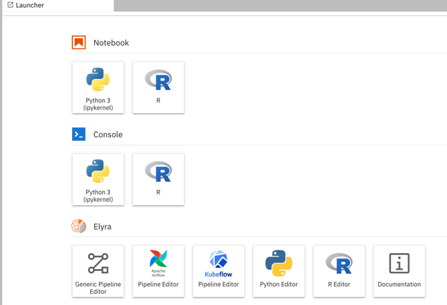
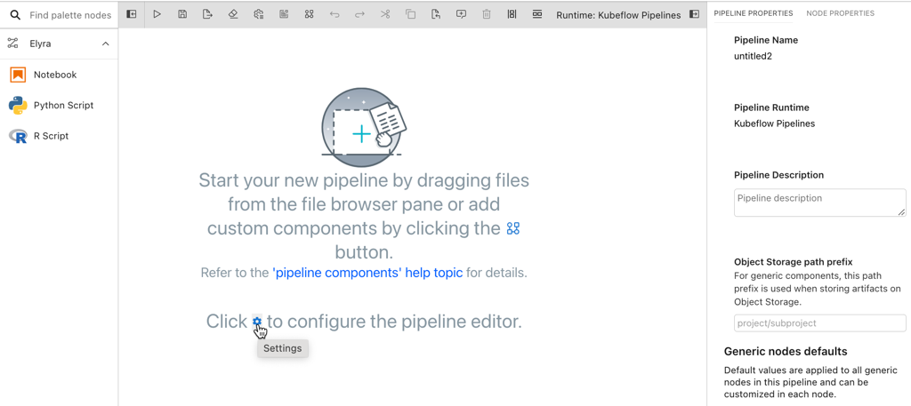
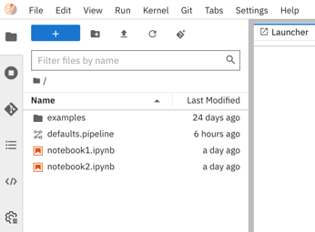
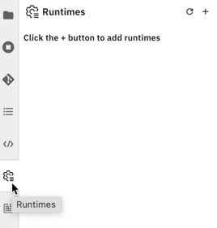
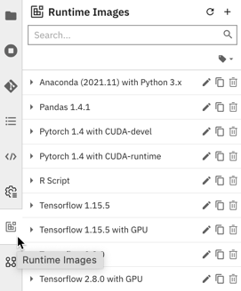
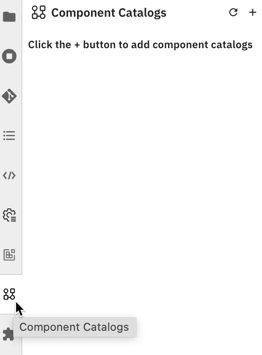

<!--

Copyright 2018-2022 Elyra Authors

Licensed under the Apache License, Version 2.0 (the "License");
you may not use this file except in compliance with the License.
You may obtain a copy of the License at

http://www.apache.org/licenses/LICENSE-2.0

Unless required by applicable law or agreed to in writing, software
distributed under the License is distributed on an "AS IS" BASIS,
WITHOUT WARRANTIES OR CONDITIONS OF ANY KIND, either express or implied.
See the License for the specific language governing permissions and
limitations under the License.

-->

## The Elyra JupyterLab interface

The Elyra extensions add multiple interfaces to the [JupyterLab GUI](https://jupyterlab.readthedocs.io/en/stable/user/interface.html). These interfaces are used to create and manage [pipelines](pipelines.md) and to create and manage metadata.

Many of these tasks can also be accomplished using the [Elyra command line interface](command-line-interface.md). 

### Launcher

Elyra adds a new category to the JupyterLab launcher, providing access to the Visual Pipeline Editor, the [Python editor](enhanced-script-support.html#python-script-execution-support), the [R editor](enhanced-script-support.html#r-script-execution-support), and the [Elyra documentation](https://elyra.readthedocs.io/en/v3.9.1/).

Note that the number of tiles in the Elyra category depends on how you [installed Elyra](../getting_started/installation.md).

### Visual Pipeline Editor

The Visual Pipeline Editor is used to work with [generic pipelines](../user_guide/pipelines.html#generic-pipelines) and [runtime-specific pipelines](../user_guide/pipelines.html#runtime-specific-pipelines).

The editor includes the component palette, the canvas with a tool bar on top, and a properties panel, shown on the left, in the center, and the right, respectively.

The palette provides access to components that you use to assemble pipelines. Components are managed using the [component catalogs sidebar](#manage-component-catalogs).

The canvas is the main work area, where you [assemble the pipeline by adding nodes, connecting and configuring them](pipelines.html#creating-pipelines-using-the-visual-pipeline-editor) .

The properties panel is used to configure pipeline properties and node properties.

You can customize the pipeline editor behavior by opening the settings link in the empty editor window or by navigating in the [JupyterLab menu bar](https://jupyterlab.readthedocs.io/en/stable/user/interface.html#menu-bar) to  `Settings > Advanced Settings Editor` and searching for `elyra`.

### Metadata management sidebars

Elyra adds multiple tabs to [JupyterLab's left sidebar](https://jupyterlab.readthedocs.io/en/stable/user/interface.html#left-and-right-sidebar). These tabs provide access to Elyra metadata, which is primarily used when you work with pipelines.

#### Manage code snippets

[Code snippets](code-snippets.md) allow for re-use of code in editors. To manage code snippets, open the `Code Snippets` tab.

#### Manage runtime configurations

[Runtime configurations](runtime-conf.md) manage access to supported runtime environments that you use to run pipelines. To manage runtime configurations, open the `Runtimes` tab.

#### Manage runtime image configurations

[Runtime image configurations](runtime-image-conf.md) identify container images that Elyra can utilize to run pipeline nodes on container-based platforms, such as Kubeflow Pipelines or Apache Airflow. To manage runtime image configurations, open the `Runtime Images` tab.

#### Manage component catalogs

[Component catalogs](pipeline-components.md) provide access to components that you use to assemble pipelines. To manage component catalogs, open the `Component Catalogs` tab.

